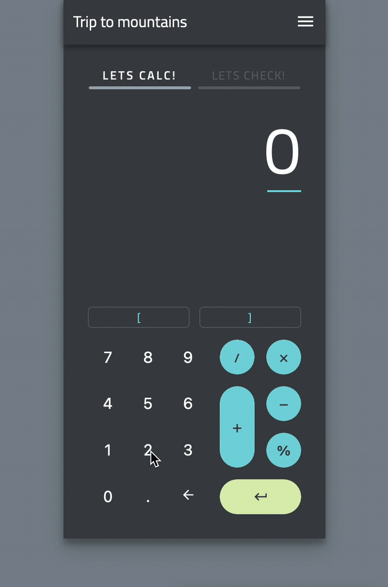

# Kalkulator z checklistą

Inteligentny kalkulator z checklistą?\
Granica między oszczędzaniem a wydawaniem jest krucha. Ale ile pieniędzy i na co
tak naprawdę wydajemy?\
Z Intel. Kalkulatorem możesz ustalić swój budżet przyszłych wydatków, aby nic
nie umknęło Twojej uwadze. Liczby są ważne, ale nadawanie znaczenia wydatkom
jeszcze ważniejsze.\
Dzięki wbudowanej funkcji tekstowej z łatwością można dodać nazwy w różnych obszarach
finansowych -zakupy, wakacje, samorozwój a może pasja? To Ty wybierasz cel a przedstawiony
kalkulator pomaga przejść tę drogę poprzez szacowanie wydatków.

## Użyte technologie:

<ul>
    <li>JavaScript</li>
    <li>React v18</li>
    <li>Typescript</li>
    <li>React Router DOM</li>
    <li>SCSS</li>
    <li>Storybook v7</li>
    <li>Context</li>
    <li>Hooks</li>
    <li>Husky and lint-staged</li>
</ul>

## Link do aplikacji:

Wdrożona aplikacja dostępna pod adresem:

<!-- https://spiffy-platypus-fb82f4.netlify.app -->

## Podgląd aplikacji:

Inspiracja z
[dribbble](https://dribbble.com/shots/6153949-Calculate-Check-Repeat)
